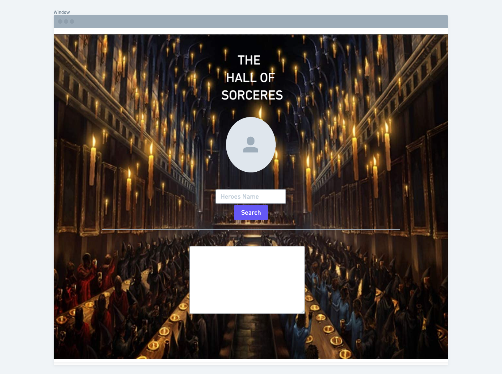
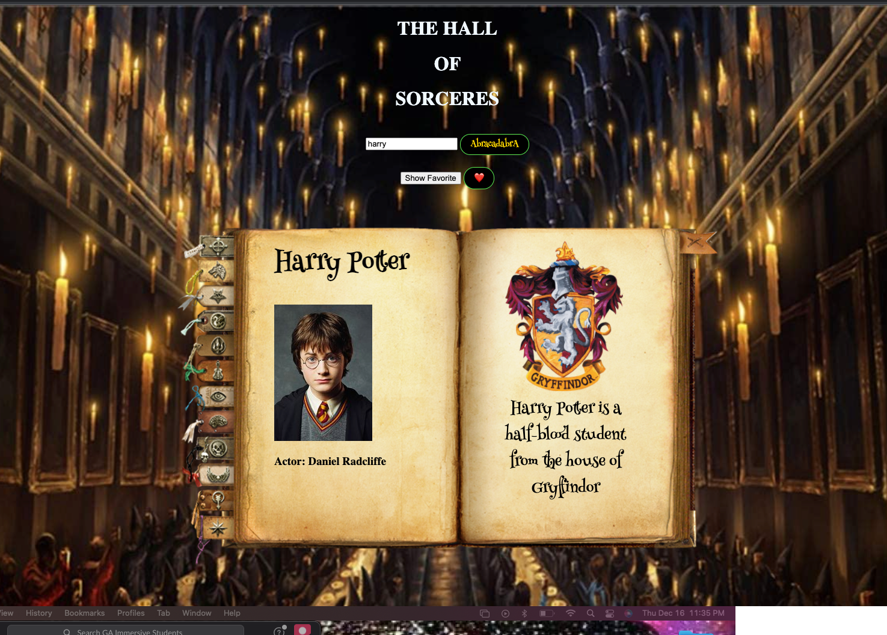
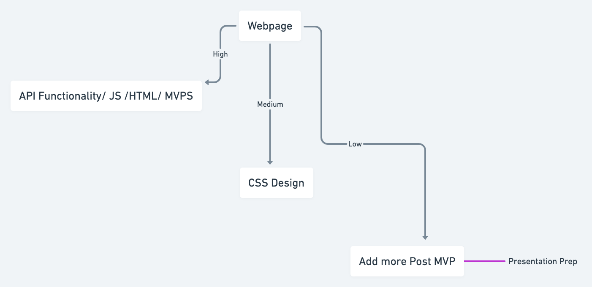

# App Title: The Hall of Heroes

### App Description: A web application that serves as a library for most of the character in the world of Harry Potter.The user will be able to search any character by name and it will return their picture, the house they belong to, their ancestry, and the real name of the actor.

### API: http://hp-api.herokuapp.com/api/characters

### API Snippet:

```
[
    {
        "name": "Harry Potter",
        "alternate_names": [
            ""
        ],
        "species": "human",
        "gender": "male",
        "house": "Gryffindor",
        "dateOfBirth": "31-07-1980",
        "yearOfBirth": 1980,
        "wizard": true,
        "ancestry": "half-blood",
        "eyeColour": "green",
        "hairColour": "black",
        "wand": {
            "wood": "holly",
            "core": "phoenix feather",
            "length": 11
        },
        "patronus": "stag",
        "hogwartsStudent": true,
        "hogwartsStaff": false,
        "actor": "Daniel Radcliffe",
        "alternate_actors": [
            ""
        ],
        "alive": true,
        "image": "http://hp-api.herokuapp.com/images/harry.jpg"
    },
    {
        "name": "Hermione Granger",
        "alternate_names": [
            ""
        ],
        "species": "human",
        "gender": "female",
        "house": "Gryffindor",
        "dateOfBirth": "19-09-1979",
        "yearOfBirth": 1979,
        "wizard": true,
        "ancestry": "muggleborn",
        "eyeColour": "brown",
        "hairColour": "brown",
        "wand": {
            "wood": "vine",
            "core": "dragon heartstring",
            "length": ""
        },
        "patronus": "otter",
        "hogwartsStudent": true,
        "hogwartsStaff": false,
        "actor": "Emma Watson",
        "alternate_actors": [
            ""
        ],
        "alive": true,
        "image": "http://hp-api.herokuapp.com/images/hermione.jpeg"
    },
    {
        "name": "Ron Weasley",
        "alternate_names": [
            ""
        ],
        "species": "human",
        "gender": "male",
        "house": "Gryffindor",
        "dateOfBirth": "01-03-1980",
        "yearOfBirth": 1980,
        "wizard": true,
        "ancestry": "pure-blood",
        "eyeColour": "blue",
        "hairColour": "red",
        "wand": {
            "wood": "willow",
            "core": "unicorn tail-hair",
            "length": 14
        },
        "patronus": "Jack Russell terrier",
        "hogwartsStudent": true,
        "hogwartsStaff": false,
        "actor": "Rupert Grint",
        "alternate_actors": [
            ""
        ],
        "alive": true,
        "image": "http://hp-api.herokuapp.com/images/ron.jpg"
    },
    {
```

### Wiredframes





### MVP:

- **Add a gif background of the Hogwarts School**
- **Add a book where the search result will appear**
- **Add a text description of the character searched**
- **Put the character name, their alias and what house they are from**
- **Add a special effect for the search buttons**

### Post-MVP:

**Add music to the background**
**Add a favorite character button**

### Goals:

| Day    | Deliverable                                       | Status   |
| ------ | ------------------------------------------------- | -------- |
| Dec 12 | API Search/ Repo ReadMe/                          | complete |
| Dec 13 | Student inputs/ Poject Approval                   | complete |
| Dec 14 | HTML Setup/ Js setup/ Result from Api/ Pseudocode | complete |
| Dec 15 | MVP implimantation/ Post MVP                      | complete |
| Dec 16 | CSS styling/ add more Post MVP if possible        | complete |
| Dec 17 | Presentations                                     | complete |

### Priority Matrix:



### Timeframes:

| Component                                             | Priority | Estimated Time | Time Invested |
| ----------------------------------------------------- | :------: | :------------: | :-----------: |
| Basic HTML, CSS, JS setup                             |    M     |      1hrs      |      1hr      |
| Setting up API and axios function                     |    H     |      4hrs      |     4hrs      |
| Response data setup/fetching                          |    H     |      2hrs      |     3hrs      |
| Filter through the response data                      |    H     |      3hrs      |     4hrs      |
| Set up the reponse to HTML                            |    H     |      3hrs      |     2hrs      |
| Incorporating the user input and API call             |    H     |      4hrs      |     3hrs      |
| Debugging of the user input/API call                  |    H     |      2hrs      |     3hrs      |
| Web page layout                                       |    H     |      3hrs      |     6hrs      |
| CSS styling of character info from search API results |    M     |      6hrs      |     8hrs      |
| CSS styling for backgound images                      |    L     |      3hrs      |     2hrs      |
| Create buttom to save favorite character              |    L     |      3hrs      |     2hrs      |
| Create an interactive serch botton                    |    L     |      3hrs      |     2hrs      |
| Total                                                 |    H     |     37hrs      |     40hrs     |
